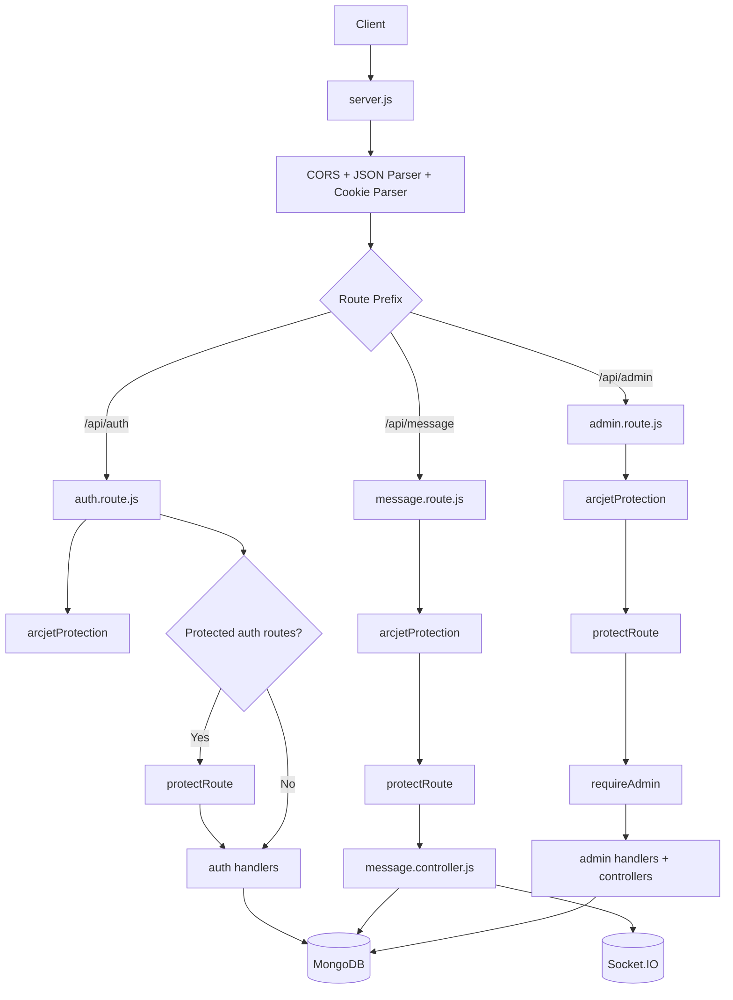
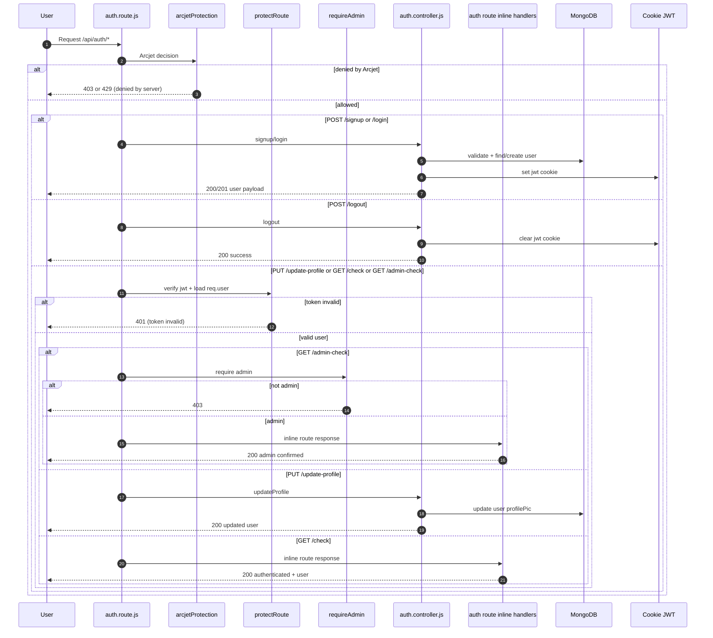
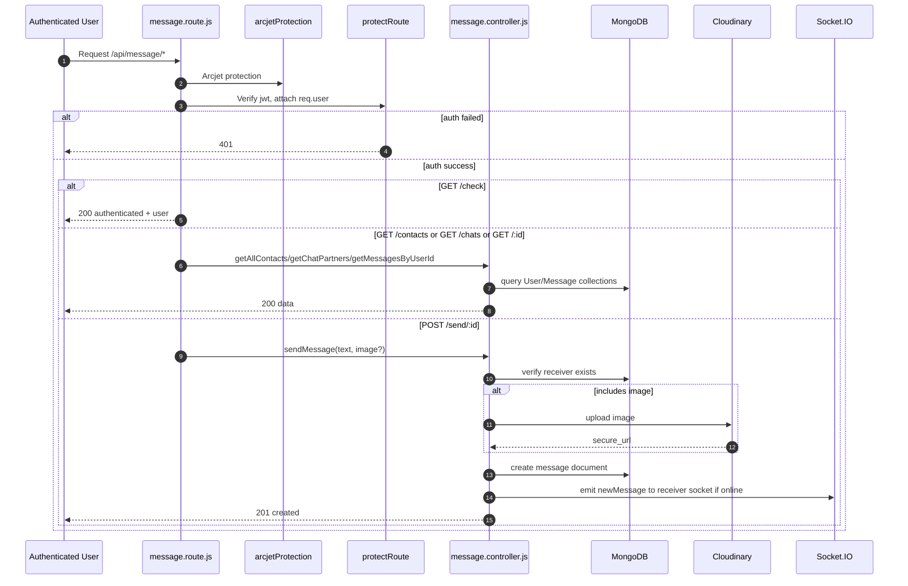
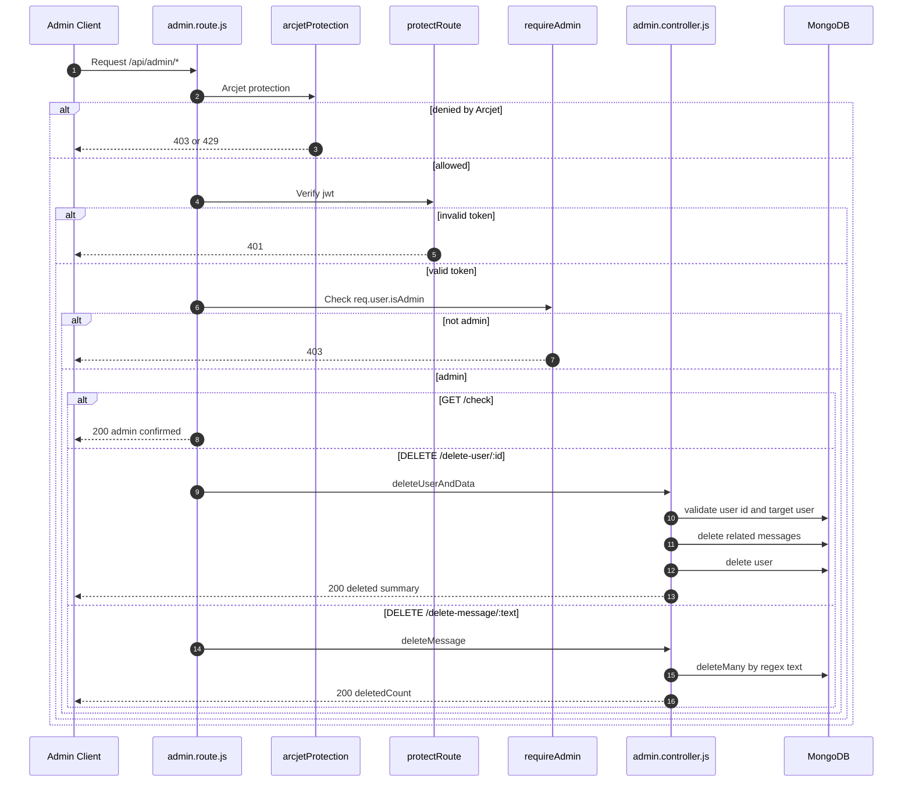
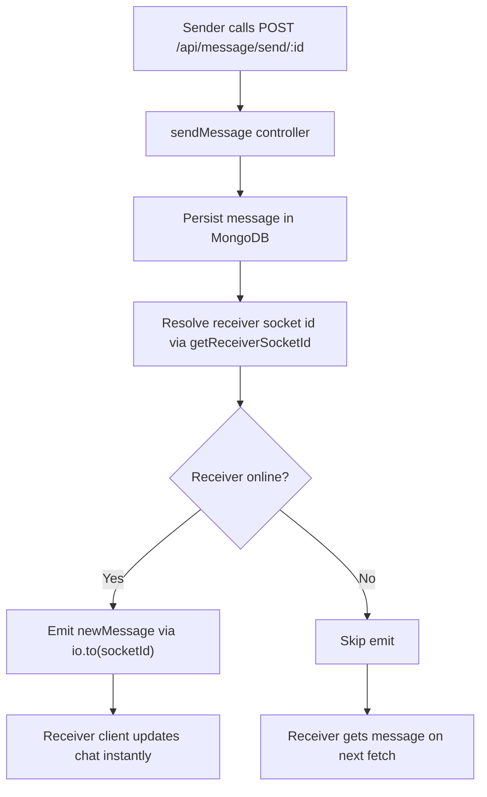

# Backend Route Flow Diagrams

This document visualizes how the backend processes requests across route groups:
- Auth routes: `/api/auth/*`
- Message routes: `/api/message/*`
- Admin routes: `/api/admin/*`

## 1) Global Request Pipeline

## 2) Auth Routes

Routes:
- `POST /api/auth/signup`
- `POST /api/auth/login`
- `POST /api/auth/logout`
- `PUT /api/auth/update-profile` (protected)
- `GET /api/auth/check` (protected)
- `GET /api/auth/admin-check` (protected + admin)

## 3) Message Routes

Routes:
- `GET /api/message/check`
- `GET /api/message/contacts`
- `GET /api/message/chats`
- `GET /api/message/:id`
- `POST /api/message/send/:id`

## 4) Admin Routes

Routes:
- `GET /api/admin/check`
- `DELETE /api/admin/delete-user/:id`
- `DELETE /api/admin/delete-message/:text`

## 5) Real-time Message Delivery via Socket.IO

## Notes

- Arcjet middleware is active on all route groups and bypassed only in test mode.
- Message routes are globally protected by authentication middleware.
- Admin operations require both authentication and admin role checks.
- JWT is stored in cookies and read by `protectRoute`.
- Production mode serves frontend static files from `frontend/dist`.
