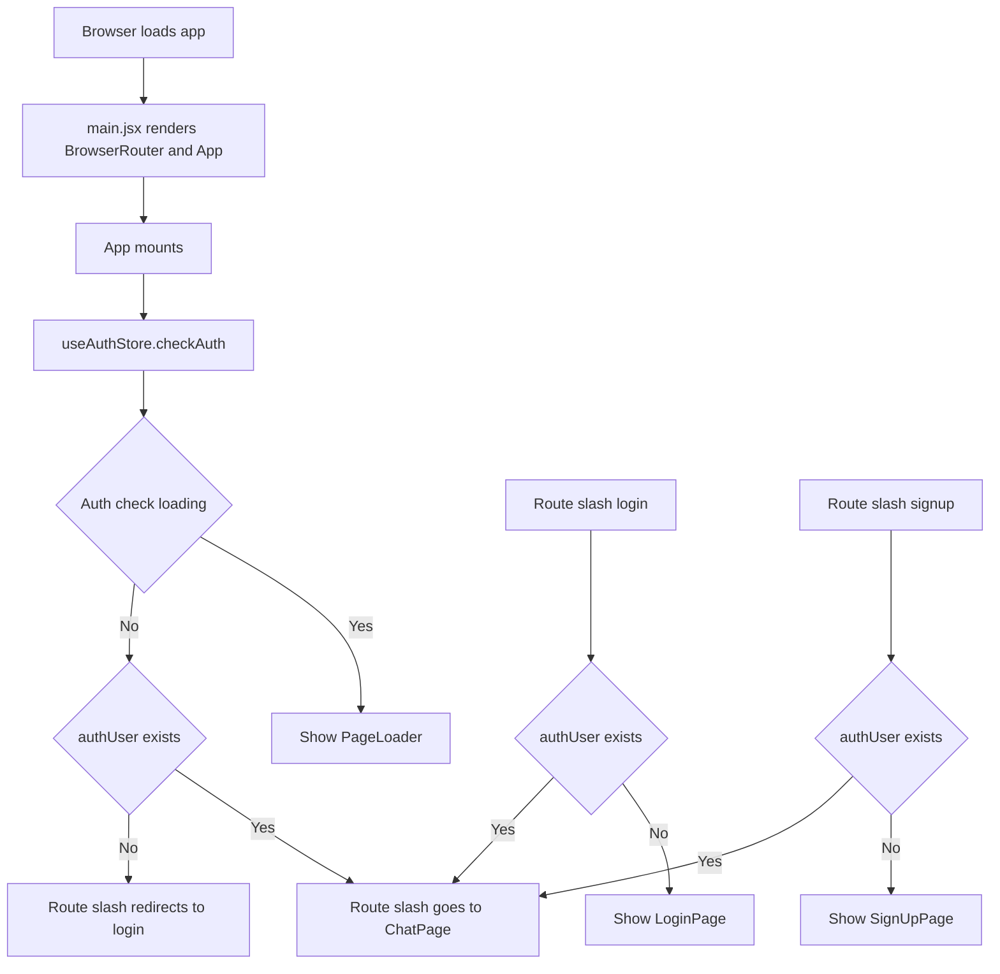
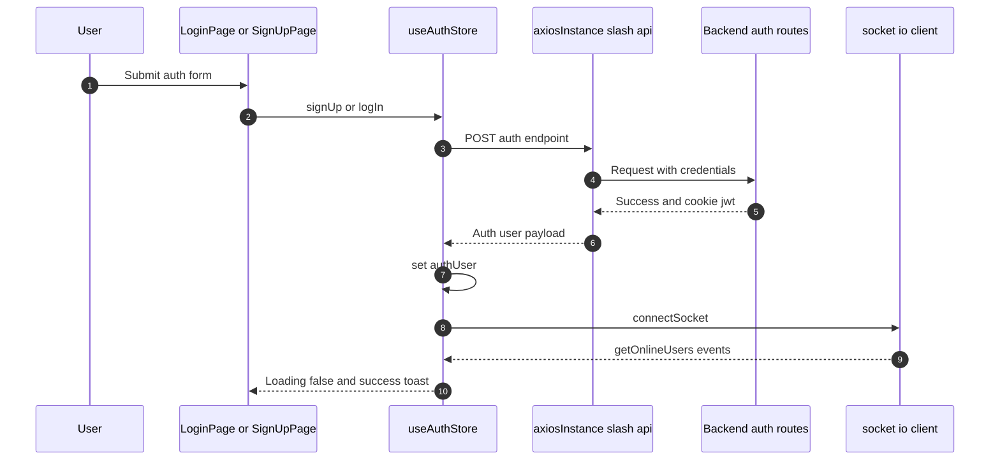
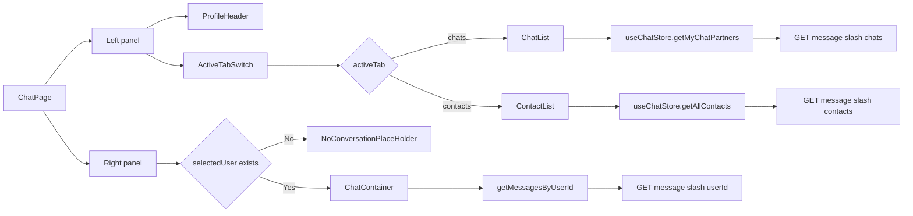
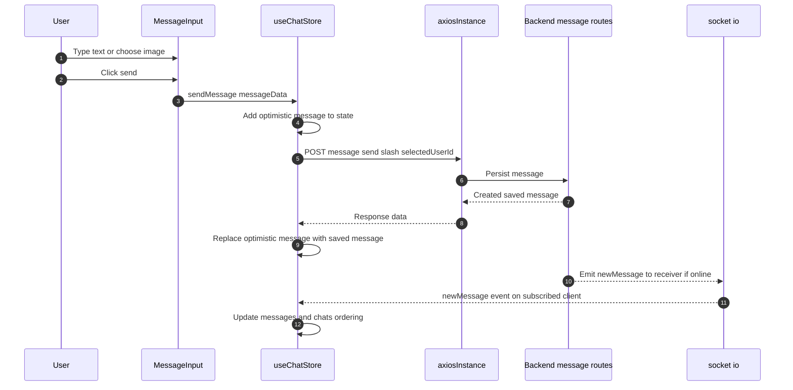
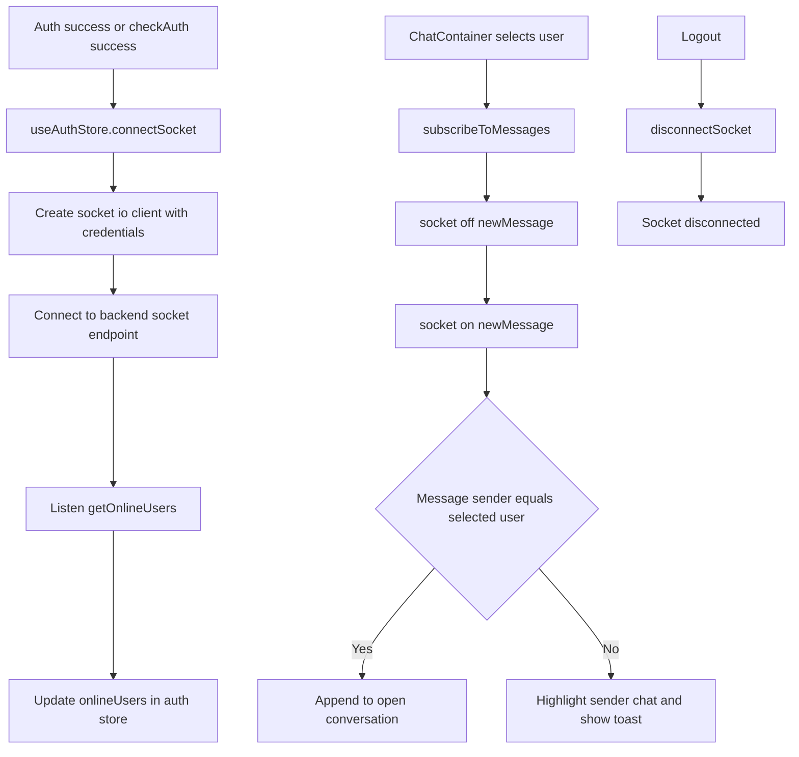

# Frontend Route And Feature Flow Diagrams

This document explains how the frontend works using diagrams for routing, authentication, chat state, API calls, and realtime messaging.

## 1) Frontend Boot And Route Guard Flow

## 2) Auth Actions To Backend

Routes used by frontend:
- `GET /api/auth/check`
- `POST /api/auth/signup`
- `POST /api/auth/login`
- `POST /api/auth/logout`
- `PUT /api/auth/update-profile`

## 3) Chat Page Composition And Data Loading

## 4) Send Message And Realtime Update

## 5) Socket Lifecycle In Frontend

## 6) Store Responsibility Map

- `useAuthStore`: auth user state, auth requests, socket connection, online users.
- `useChatStore`: contacts, chats, messages, selected user, send message, subscribe and unsubscribe to realtime events.
- `axiosInstance`: base URL and cookie credentials for all API requests.

## Notes

- Frontend routing is protected at component level in `App.jsx` using `Navigate`.
- JWT is stored in cookies by backend and sent automatically because axios uses `withCredentials: true`.
- Message sending uses optimistic UI for fast feedback, then reconciles with backend response.
